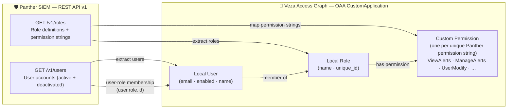

# Panther → Veza OAA Integration

Collects identity and permission data from **Panther SIEM** via the Panther REST API
(OAuth 2.0 client credentials grant) and pushes it into the Veza Access Graph as an
OAA `CustomApplication`.

---

## 1. Overview

`panther.py` authenticates to Panther using OAuth 2.0 client credentials, fetches all
users and roles from the Panther `/v1` REST API, maps them to Veza OAA entities, and
pushes the payload to a Veza instance.

### Entity model

| Panther entity | OAA entity type | Notes |
|---|---|---|
| Panther instance | `CustomApplication` | One per `PANTHER_BASE_URL` |
| Panther user | `Local User` | Active **and** deactivated users |
| Panther role | `Local Role` | All roles including custom ones |
| Panther permission string | `Custom Permission` | Each unique string registered as an OAA permission |

### Permission mapping

Each Panther permission string (e.g. `ViewAlerts`, `ManageAlerts`, `UserModify`) is
registered as an individual OAA custom permission.  The string is classified into an
OAA permission level by keyword matching:

| Keyword pattern | OAA permission classes |
|---|---|
| `admin` | DataRead, DataWrite, MetadataRead, MetadataWrite, NonBusinessContent |
| `modify`, `manage`, `create`, `delete`, `write`, `upload`, `run`, `send` | DataRead, DataWrite |
| All others (view, read, list, …) | DataRead |

### Data flow

```
Panther REST API /v1/users  ──┐
                              ├──► panther.py ──► OAA CustomApplication ──► Veza
Panther REST API /v1/roles  ──┘
```

---

## 2. Entity Relationship Map



---

## 3. How It Works

1. **OAuth2 token acquisition** — posts `grant_type=client_credentials` with
   `client_id` and `client_secret` (HTTP Basic Auth) to the configured token URL.
   An optional `scope` parameter is included when `PANTHER_SCOPE` is set.
2. **Fetch roles** — paginates `GET /v1/roles` with cursor-based pagination (60 per
   page) until all roles are retrieved.
3. **Fetch users** — paginates `GET /v1/users?include-deactivated=true` to include
   both active and deactivated accounts.
4. **Build OAA payload** — creates a `CustomApplication`, registers each unique
   Panther permission string, adds roles with their permissions, adds users with
   role memberships.
5. **Push to Veza** — calls `OAAClient.push_application()` with `create_provider=True`
   so the provider is created automatically on first run.
6. **Milestone progress** — prints a visual progress bar to stdout after each of the
   five steps above.

---

## 4. Prerequisites

| Requirement | Minimum |
|---|---|
| Python | 3.9 |
| OS | RHEL 8+ / CentOS Stream / Amazon Linux 2023 / Ubuntu 20.04+ |
| Network access to | Panther API base URL (HTTPS 443) |
| Network access to | OAuth2 token URL (HTTPS 443) |
| Network access to | Veza instance URL (HTTPS 443) |
| Veza API token permissions | `OAA Manage` (write) |
| Panther OAuth2 client | `client_credentials` grant enabled; scope granting `Read User Info` |

---

## 5. Quick Start (one-command install)

```bash
curl -fsSL https://raw.githubusercontent.com/andrewmusto-git/Panther-3250/main/integrations/panther/install_panther.sh | bash
```

For non-interactive / CI installs, set environment variables before piping:

```bash
VEZA_URL=https://myco.veza.com \
VEZA_API_KEY=<key> \
PANTHER_BASE_URL=https://api.myco.runpanther.net \
PANTHER_TOKEN_URL=https://myco.auth.us-east-1.amazoncognito.com/oauth2/token \
PANTHER_CLIENT_ID=<id> \
PANTHER_CLIENT_SECRET=<secret> \
PANTHER_SCOPE=panther:api \
bash <(curl -fsSL https://raw.githubusercontent.com/andrewmusto-git/Panther-3250/main/integrations/panther/install_panther.sh) --non-interactive
```

---

## 6. Manual Installation

### RHEL / CentOS / Amazon Linux

```bash
sudo dnf install -y git python3 python3-pip
python3 -m venv --help &>/dev/null || sudo dnf install -y python3-virtualenv

mkdir -p /opt/VEZA/panther3250-veza/{scripts,logs}
cd /opt/VEZA/panther3250-veza/scripts

git clone --depth 1 https://github.com/andrewmusto-git/Panther-3250 /tmp/panther-repo
cp /tmp/panther-repo/integrations/panther/panther.py .
cp /tmp/panther-repo/integrations/panther/requirements.txt .
rm -rf /tmp/panther-repo

python3 -m venv venv
venv/bin/pip install -r requirements.txt
cp /path/to/your/.env.example .env
chmod 600 .env
```

### Ubuntu / Debian

```bash
sudo apt-get update && sudo apt-get install -y git python3 python3-pip python3-venv

mkdir -p /opt/VEZA/panther3250-veza/{scripts,logs}
cd /opt/VEZA/panther3250-veza/scripts

git clone --depth 1 https://github.com/andrewmusto-git/Panther-3250 /tmp/panther-repo
cp /tmp/panther-repo/integrations/panther/panther.py .
cp /tmp/panther-repo/integrations/panther/requirements.txt .
rm -rf /tmp/panther-repo

python3 -m venv venv
venv/bin/pip install -r requirements.txt
cp /path/to/your/.env.example .env
chmod 600 .env
```

### Configure `.env`

Edit `.env` and populate all required values:

```bash
PANTHER_BASE_URL=https://api.myco.runpanther.net
PANTHER_TOKEN_URL=https://myco.auth.us-east-1.amazoncognito.com/oauth2/token
PANTHER_CLIENT_ID=your_client_id
PANTHER_CLIENT_SECRET=your_client_secret
PANTHER_SCOPE=panther:api

VEZA_URL=https://myco.veza.com
VEZA_API_KEY=your_veza_api_key
```

---

## 7. Usage

```
usage: panther.py [-h] [--env-file ENV_FILE]
                  [--veza-url VEZA_URL] [--veza-api-key VEZA_API_KEY]
                  [--provider-name PROVIDER_NAME] [--datasource-name DATASOURCE_NAME]
                  [--panther-base-url PANTHER_BASE_URL]
                  [--panther-token-url PANTHER_TOKEN_URL]
                  [--panther-client-id PANTHER_CLIENT_ID]
                  [--panther-client-secret PANTHER_CLIENT_SECRET]
                  [--panther-scope PANTHER_SCOPE]
                  [--dry-run] [--save-json]
                  [--log-level {DEBUG,INFO,WARNING,ERROR}]
```

### CLI arguments

| Argument | Required | Values | Default | Description |
|---|---|---|---|---|
| `--env-file` | No | path | `.env` | Path to credentials file |
| `--veza-url` | Yes* | URL | `VEZA_URL` env | Veza instance base URL |
| `--veza-api-key` | Yes* | string | `VEZA_API_KEY` env | Veza API key |
| `--provider-name` | No | string | `Panther` | Provider label in Veza UI |
| `--datasource-name` | No | string | hostname of base URL | Datasource label in Veza UI |
| `--panther-base-url` | Yes | URL | `PANTHER_BASE_URL` env | Panther API base URL |
| `--panther-token-url` | Yes | URL | `PANTHER_TOKEN_URL` env | OAuth2 token endpoint |
| `--panther-client-id` | Yes | string | `PANTHER_CLIENT_ID` env | OAuth2 client ID |
| `--panther-client-secret` | Yes | string | `PANTHER_CLIENT_SECRET` env | OAuth2 client secret |
| `--panther-scope` | No | string | `PANTHER_SCOPE` env | OAuth2 scope |
| `--dry-run` | No | flag | false | Build payload, skip Veza push |
| `--save-json` | No | flag | false | Save payload as JSON file |
| `--log-level` | No | DEBUG/INFO/WARNING/ERROR | `INFO` | Log verbosity |

\* Required unless `--dry-run` is used.

### Examples

```bash
# Validate everything without pushing
python3 panther.py --dry-run --save-json --log-level DEBUG

# Live push using defaults from .env
python3 panther.py --env-file .env

# Override provider and datasource labels
python3 panther.py --provider-name "Panther SIEM" --datasource-name "panther-prod"

# Non-interactive with all credentials on the command line
python3 panther.py \
  --panther-base-url https://api.myco.runpanther.net \
  --panther-token-url https://myco.auth.us-east-1.amazoncognito.com/oauth2/token \
  --panther-client-id abc123 \
  --panther-client-secret s3cr3t \
  --panther-scope panther:api \
  --veza-url https://myco.veza.com \
  --veza-api-key vz_... \
  --save-json
```

---

## 8. Deployment on Linux

### Service account

```bash
sudo useradd -r -s /bin/bash -m -d /opt/VEZA/panther3250-veza panther3250-veza
sudo chown -R panther3250-veza:panther3250-veza /opt/VEZA/panther3250-veza
sudo chmod 700 /opt/VEZA/panther3250-veza/scripts
sudo chmod 600 /opt/VEZA/panther3250-veza/scripts/.env
```

### SELinux (RHEL)

```bash
getenforce
# If Enforcing, restore context after copying files:
sudo restorecon -Rv /opt/VEZA/panther3250-veza
```

### Cron scheduling

Create a wrapper script at `/opt/VEZA/panther3250-veza/scripts/run_panther.sh`:

```bash
#!/usr/bin/env bash
set -euo pipefail
cd /opt/VEZA/panther3250-veza/scripts
source venv/bin/activate
python3 panther.py --env-file .env >> /opt/VEZA/panther3250-veza/logs/cron.log 2>&1
```

```bash
chmod +x /opt/VEZA/panther3250-veza/scripts/run_panther.sh
```

Add to `/etc/cron.d/panther3250-veza`:

```cron
# Panther → Veza OAA sync — daily at 02:00 AM
0 2 * * * panther3250-veza /opt/VEZA/panther3250-veza/scripts/run_panther.sh
```

### Log rotation

Create `/etc/logrotate.d/panther3250-veza`:

```
/opt/VEZA/panther3250-veza/logs/*.log {
    daily
    rotate 30
    compress
    missingok
    notifempty
    su panther3250-veza panther3250-veza
}
```

---

## 9. Multiple Instances

To push data from multiple Panther environments to the same Veza instance, maintain
separate `.env` files and use `--env-file` plus `--datasource-name`:

```bash
python3 panther.py --env-file .env.prod  --datasource-name panther-prod
python3 panther.py --env-file .env.stage --datasource-name panther-stage
```

Stagger cron jobs by at least 5 minutes to avoid rate-limit collisions.

---

## 10. Security Considerations

- The `.env` file contains secrets — always `chmod 600` and **never commit it**.
- Run the connector as a dedicated least-privilege service account.
- Rotate `PANTHER_CLIENT_SECRET` and `VEZA_API_KEY` on a schedule (90-day minimum).
- Restrict `PANTHER_CLIENT_ID` to read-only Panther scopes (`Read User Info`).
- On RHEL, verify SELinux context with `ls -Z /opt/VEZA/panther3250-veza/scripts/.env`.

---

## 11. Troubleshooting

### OAuth2 token request fails

- Verify `PANTHER_TOKEN_URL` resolves and returns HTTP 200 with curl:
  ```bash
  curl -v -X POST "${PANTHER_TOKEN_URL}" \
    -u "${PANTHER_CLIENT_ID}:${PANTHER_CLIENT_SECRET}" \
    -d "grant_type=client_credentials&scope=${PANTHER_SCOPE}"
  ```
- Confirm the OAuth2 client is enabled and the client secret has not expired.

### API calls return 401 / 403

- Confirm the token includes the `Read User Info` permission in Panther.
- Verify `PANTHER_BASE_URL` does not have a trailing slash or extra path segments.
- Re-run with `--log-level DEBUG` to inspect request URLs and response codes.

### Missing Python modules

```bash
cd /opt/VEZA/panther3250-veza/scripts
venv/bin/pip install -r requirements.txt
```

### Veza push warnings

Review the warning messages emitted after `push_application()`.  Common causes:
- Duplicate `unique_id` values in the payload (check for duplicate Panther IDs).
- Unknown permission names — confirm custom permission strings are registered before
  being referenced.

### Empty results

- Check that the OAuth2 client has `Read User Info` access in Panther RBAC settings.
- Confirm that `include-deactivated=true` is accepted by your Panther version.

---

## 12. Changelog

| Version | Date | Notes |
|---|---|---|
| 1.0.0 | 2026-05-11 | Initial release — OAuth2 client credentials, users + roles, milestone progress |
